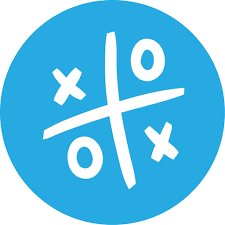

# Gato Simple - Tic-Tac-Toe Multiplayer

Aplicación móvil desarrollada en **Flutter** para jugar gato/Tic-Tac-Toe en tiempo real con autenticación, salas compartidas y persistencia de partidas usando Firebase.

<div align="center">
<table>
<tr>
<td align="center">
<b>Logo institucional</b><br><br>

</td>
<td align="center">
<b>Icono de la app</b><br><br>

</td>
</tr>
</table>
</div>

## Integrantes

- Daniel Morales
- Dilan Bañuelos

## Descripción

**Gato Simple** conserva la funcionalidad multijugador en tiempo real de la aplicación original, pero cambia el estilo visual a una interfaz limpia, clara y sencilla. Se eliminó el modo de símbolos rotativos para dejar solamente los modos principales del juego.

Funciones principales:

- Registro e inicio de sesión con Firebase Authentication.
- Creación de sala con código alfanumérico de 6 caracteres.
- Unión a sala mediante código.
- Sincronización de tablero en tiempo real con Firebase Realtime Database.
- Detección automática de victoria, derrota y empate.
- Animación de marcas en tablero.
- Línea ganadora destacada visualmente.
- Pantalla de resultados.
- Ranking Top 10 usando Firestore.
- Diseño nuevo con fondo claro, tarjetas simples y colores sobrios.

## Modos disponibles

- **Clásico 3x3:** dos jugadores, línea ganadora de 3.
- **Multijugador 4:** hasta cuatro jugadores, tablero 6x6 y línea ganadora de 4.

El modo de símbolos rotativos fue retirado para simplificar la experiencia y evitar que la aplicación se vea como la versión anterior.

## Tecnologías utilizadas

- Flutter SDK 3.x
- Dart 3.x
- Firebase Core
- Firebase Authentication
- Firebase Realtime Database
- Cloud Firestore
- Provider
- Google Fonts

## Estructura principal

```bash
lib/
├── app.dart
├── main.dart
├── core/
│   ├── theme/app_colors.dart
│   ├── theme/app_theme.dart
│   └── utils/validators.dart
├── data/
│   ├── models/
│   │   ├── app_user.dart
│   │   ├── game_mode.dart
│   │   ├── game_room.dart
│   │   └── room_player.dart
│   └── repositories/
│       ├── auth_repository.dart
│       ├── ranking_repository.dart
│       └── room_repository.dart
├── features/
│   ├── auth/
│   ├── game/
│   ├── home/
│   ├── lobby/
│   ├── modes/
│   ├── ranking/
│   └── results/
└── shared/widgets/
    ├── app_background.dart
    ├── brand_widgets.dart
    ├── gold_button.dart
    ├── obsidian_card.dart
    └── text_input_field.dart
```

## Cambios de rediseño

- Se reemplazó el fondo oscuro/neón por un fondo claro con patrón tipo cuadrícula sutil.
- Se cambiaron las tarjetas a un estilo blanco, plano y limpio.
- Se sustituyeron los colores brillantes por una paleta azul, blanco, gris y acentos sobrios para X/O.
- Se cambió el nombre visible de la app a **Gato Simple**.
- Se actualizó el crédito de integrantes del equipo.
- Se eliminó el modo `rotatingSymbols` del modelo, selector y lógica de partida.
- Se conservó la lógica de autenticación, salas, turnos, movimientos, ranking y resultados.

## Flujo de uso

1. El usuario se registra o inicia sesión.
2. Selecciona modo de juego.
3. Crea una sala o se une con código.
4. La partida inicia cuando hay jugadores suficientes.
5. Cada movimiento se sincroniza en tiempo real.
6. Al terminar, se muestra el resultado y se actualiza el historial/ranking.

## Requisitos cumplidos

- Logo de Universidad de Sonora en autenticación.
- Registro con nombre, correo y contraseña.
- Inicio de sesión con correo y contraseña.
- Sala de espera con saludo, creación de sala, unión por código y cierre de sesión.
- Tablero interactivo según turno.
- Indicadores de turno, jugador y símbolo.
- Sincronización en tiempo real.
- Detección de victoria, derrota y empate.
- Animación de marcas y línea ganadora.
- Pantalla de resultados.
- Persistencia de partidas finalizadas.
- Ranking Top 10 como punto extra.

## Ejecución

```bash
flutter clean
flutter pub get
flutter run
```

Para generar APK:

```bash
flutter build apk --release
```

## Notas

La app depende de la configuración existente en `firebase_options.dart`. Antes de presentar, conviene probar registro, login, creación de sala, unión desde otro dispositivo, inicio de partida, victoria, empate y actualización del ranking.
