# 🎮 TicTacToe Unison - Multiplayer (Flutter)

Aplicación móvil desarrollada en **Flutter** para un TicTacToe avanzado con modos cooperativos, tablero dinámico y lógica en tiempo real usando Firebase.

<br>
<div align="center">
<table>
<tr>
<td align="center">
<b>Unison Logo</b><br><br>

</td>
<td align="center">
<b>TicTacToe Logo</b><br><br>

</td>
</tr>
</table>
</div>

<br><br>

---

## 👨‍💻 Autores

- Daniel Morales
- Dilan Bañuelos

---

## 📌 Descripción del proyecto

**TicTacToe Unison** es una versión moderna de tres en línea con:

- Partidas en vivo con Firebase Realtime Database y Firestore (historial y ranking).
- Modos de juego: Clásico 3x3, Multijugador 4 (6x6), Símbolos rotativos.
- Gestión de sala (código alfanumérico de 6 caracteres), invitados y estado de jugador.
- Visuales estilizados con `AppBackground`, tarjetas `ObsidianCard`, y botones `GoldButton`.
- Lógica de turno, detección de línea ganadora, empate, historial de movimientos y líneas destacadas con `CustomPainter`.
- Resultados en pantalla y retroalimentación en tiempo real.

---

## 🛠 Tecnologías utilizadas

### 📱 Desarrollo

- Flutter SDK (versión 3.x+)
- Dart (3.x)
- Firebase Auth, Realtime Database, Firestore
- Provider para estado y repositorios

### 🎮 Principales dependencias

- provider
- firebase_auth
- firebase_database
- cloud_firestore

---

## 🧩 Estructura del proyecto (`lib/`)

```bash
lib/
├── main.dart                            # Inicializa Firebase y lanza TicTacticApp
├── app.dart                             # MaterialApp con tema y home
├── core/
│   ├── theme/app_theme.dart             # ThemeData, tipografías, constantes visuales
│   └── theme/app_colors.dart            # Paleta de colores (xColor, oColor, etc.)
├── data/
│   ├── models/
│   │   ├── game_mode.dart               # Enum de modos y propiedades (boardSize, winLength, key)
│   │   ├── game_room.dart               # Estado completo de sala/partida y mapeo desde DB
│   │   ├── room_player.dart             # Modelo de jugador en sala
│   │   └── app_user.dart                # Datos de usuario con propiedades Firebase
│   └── repositories/
│       ├── auth_repository.dart         # Login, signOut, usuario actual
│       └── room_repository.dart         # Creación, join room, startMatch, makeMove, win checks, replay
├── features/
│   ├── auth/
│   │   ├── login_screen.dart            # UI de autenticación con Firebase
│   │   └── auth_controller.dart         # Control de sesión y logout
│   ├── home/
│   │   └── home_gate.dart               # Switch entre login y selección de modo
│   ├── modes/
│   │   └── mode_selection_screen.dart   # Selección de `GameMode`
│   ├── lobby/
│   │   └── waiting_room_screen.dart     # Vista previa de sala, jugadores conectados y START
│   ├── game/
│   │   └── game_screen.dart            # Tablero, turno, move tap y detección de ganador
│   ├── results/
│   │   └── results_screen.dart         # Pantalla final con ganador, empate y replay
│   └── ranking/
│       └── ranking_screen.dart         # Tabla de posiciones desde Firestore
├── shared/
│   ├── widgets/app_background.dart      # Fondo de app, bordes y relleno
│   ├── widgets/obsidian_card.dart       # Tarjetas estilo neón
│   ├── widgets/brand_widgets.dart       # Textos Eyebrow, status dots
│   ├── widgets/gold_button.dart         # Botones decorativos
│   └── widgets/text_input_field.dart    # Campos personalizados
└── firebase_options.dart                # Config auto-generada de Firebase
```

---

## 🔍 Detalle de clases clave

### `data/models/game_mode.dart`

- `enum GameMode { classic, multiplayer4, rotatingSymbols }`
- Propiedades calculadas:
  - `key`, `title`, `shortTitle`, `description`, `boardSize`, `maxPlayers`, `winLength`, `minPlayersToStart`
- Se utiliza para definir comportamiento de partida y UI de selección de modo.

### `data/models/game_room.dart`

- `GameRoom` con:
  - `roomCode`, `hostId`, `mode`, `boardSize`, `winLength`, `status`, `currentTurnIndex`, `currentSymbol`, `nextSymbol`, `board`, `players`, `moves`, `winner`, `isDraw`, `winningCells`
- Getters: `isFinished`, `isPlaying`, `isWaiting`, `currentPlayer`
- `GameMove` encapsula un movimiento individual y permite historial.
- `fromMap()` normaliza datos desde Realtime Database.

### `data/models/room_player.dart`

- Modelo jugador con propiedades: `uid`, `name`, `symbol`, `colorHex`, `isHost`, `isOnline`, `score`, `joinOrder`.
- Métodos: `copyWith`, `toMap`, `fromMap`.

### `data/repositories/room_repository.dart`

- Lógica de sala y reglas de juego:
  - `generateRoomCode()`, `_emptyBoard()`, `_symbolPalette()`
  - `createRoom()`, `joinRoom()`, `watchRoom()`, `startMatch()`
  - `makeMove()` con transacción RTDB, validación de turnos y tablero, detección de victoria/empate, rotación de símbolo
  - `replayRoom()`, `leaveRoom()`, `_persistFinishedGame()` (actualiza Firestore/leadboard)
  - `_findWinner()` con chequeo de líneas horizontales/verticales/diagonales

### `features/game/game_screen.dart`

- Vista principal de partida con `StreamBuilder<GameRoom?>`.
- Renderización del tablero con `GridView`, manejo de tap, animación de celdas y estilo de símbolos.
- Detección de turno y estado de jugador (`isMyTurn`).
- Dibuja línea ganadora en `CustomPaint` (`_WinningLinePainter`).
- Historial de jugadas (últimas 6) y referencias de estado.

### `features/modes/mode_selection_screen.dart`

- Selector visual de modos con `ObsidianCard`, `GoldButton` y previews.
- Botón `CONTINUAR` abre `WaitingRoomScreen`.

---

## 🎮 Flujo de experiencia de usuario

1. El usuario inicia en `HomeGate`; si no está autenticado va a `LoginScreen`, si sí va a `ModeSelectionScreen`.
2. Selecciona modo (Clásico / 4 jugadores / Rotativo) en `ModeSelectionScreen`.
3. Crea sala o se une con código en `WaitingRoomScreen` (modo lobby multisala).
4. Host arranca juego (`startMatch`), tablero se inicializa desde `RoomRepository`.
5. Cada jugador realiza jugadas con `makeMove`; la lógica detecta ganador/empate y actualiza el tablero en tiempo real.
6. Al finalizar, `ResultsScreen` muestra ganador/empate y ofrece reproducir partida.

---

## 🖼 Imágenes de la aplicación

### Icono de la app

<div align="center">

</div>

## Instalación

<div align="center">
<table>
<tr>
<td align="center">
<b>Instalación</b><br><br>
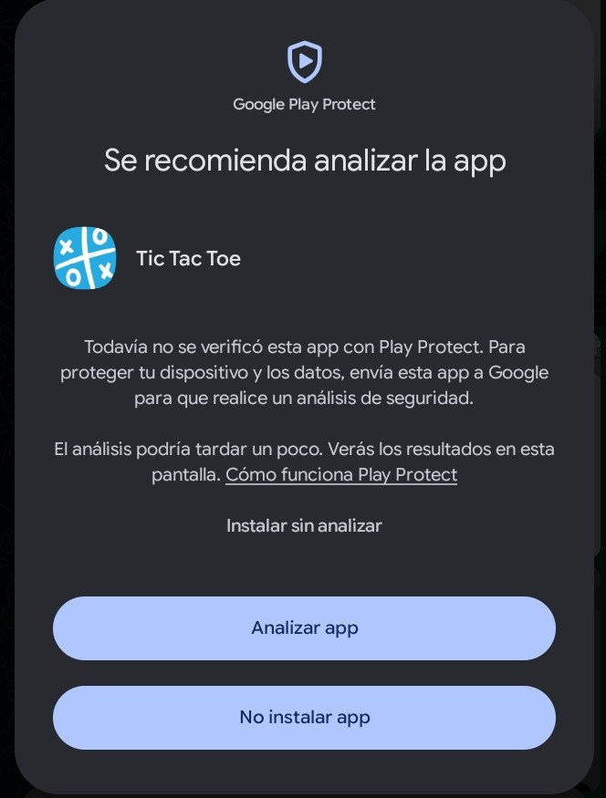
</td>
<td align="center">
<b>Instalación</b><br><br>
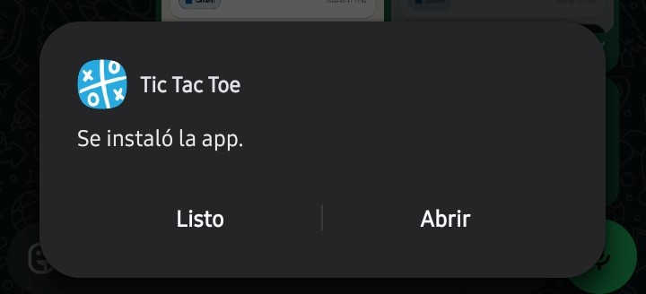
</td>
</tr>
</table>
</div>

### Interfaz principal y navegación

<div align="center">
<table>
<tr>
<td align="center">
<b>Login Screen</b><br><br>
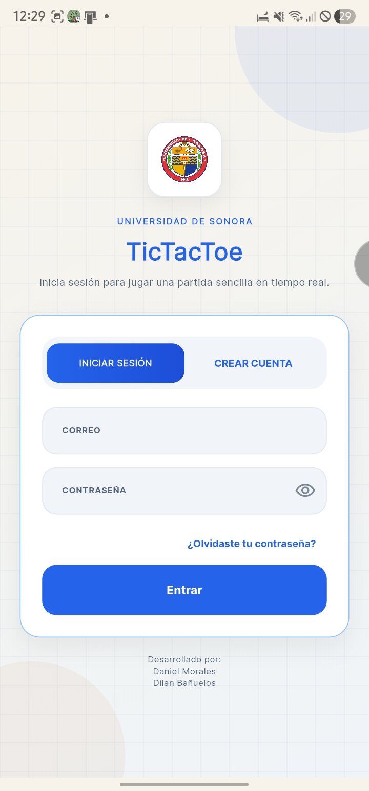
</td>
<td align="center">
<b>Create Profile Screen</b><br><br>
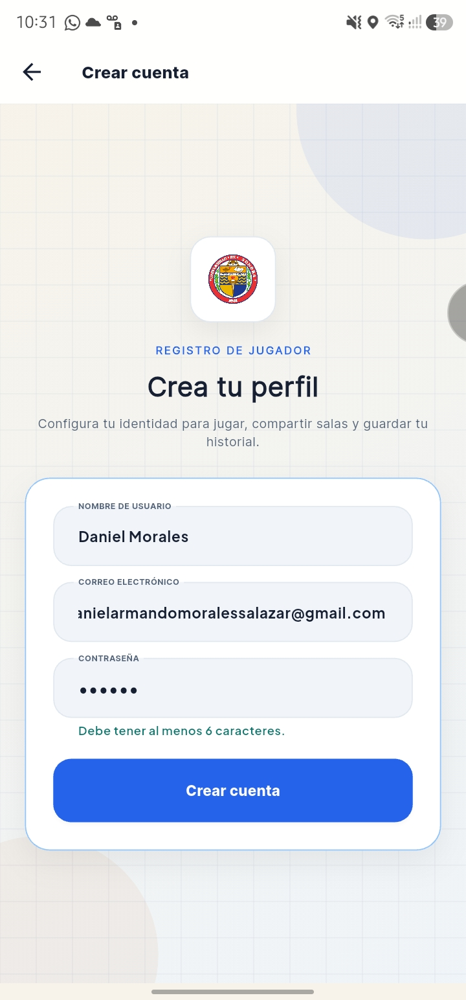
</td>
</tr>
</table>
</div>

<div align="center">
<table>
<tr>
<td align="center">
<b>Modos de juego</b><br><br>
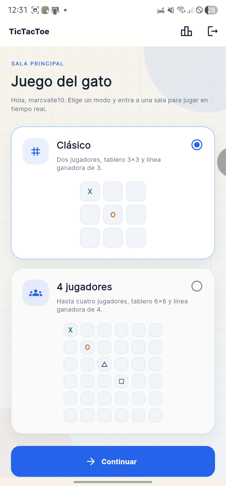
</td>
<td align="center">
<b>Modo Clasico</b><br><br>

</td>
</tr>
</table>
</div>

<div align="center">
<table>
<tr>
<td align="center">
<b>Modo Clasico</b><br><br>
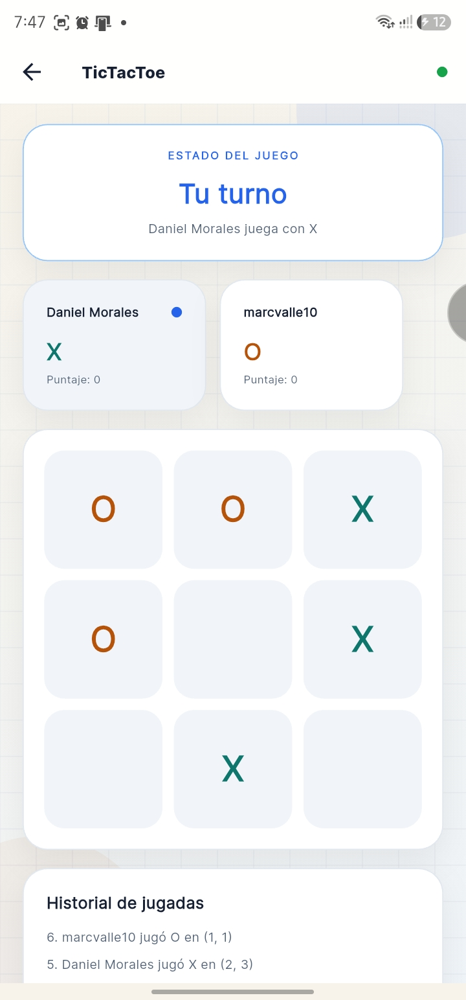
</td>
<td align="center">
<b>Modo Clasico</b><br><br>
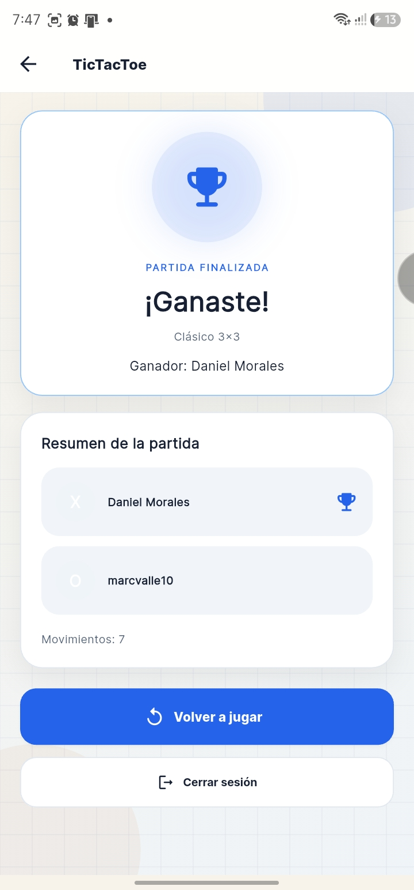
</td>
</tr>
</table>
</div>

<div align="center">
<table>
<tr>
<td align="center">
<b>Modo Multi</b><br><br>
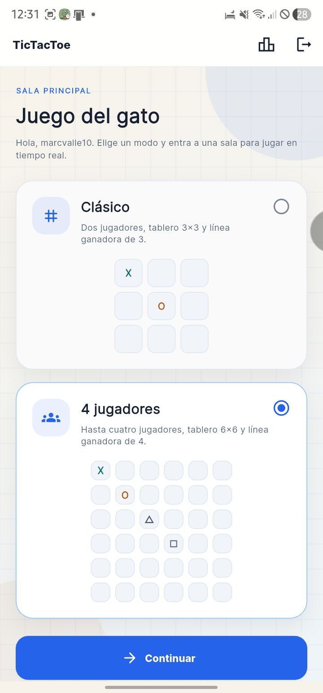
</td>
<td align="center">
<b>Modo Multi</b><br><br>
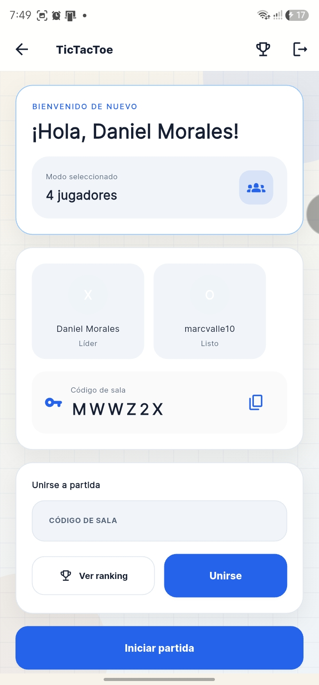
</td>
<td align="center">
<b>Modo Multi</b><br><br>
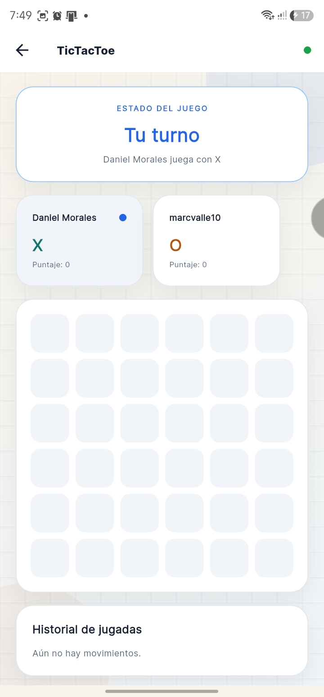
</td>
</tr>
</table>
</div>

<div align="center">
<table>
<tr>
<td align="center">
<b>Modo Multi</b><br><br>
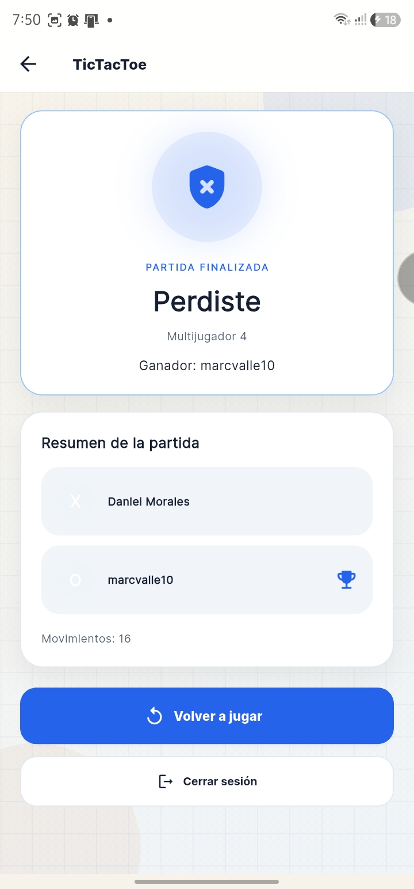
</td>
</tr>
</table>
</div>

### Ranking

<div align="center">
<table>
<tr>
<td align="center">
<b>Ranking</b><br><br>
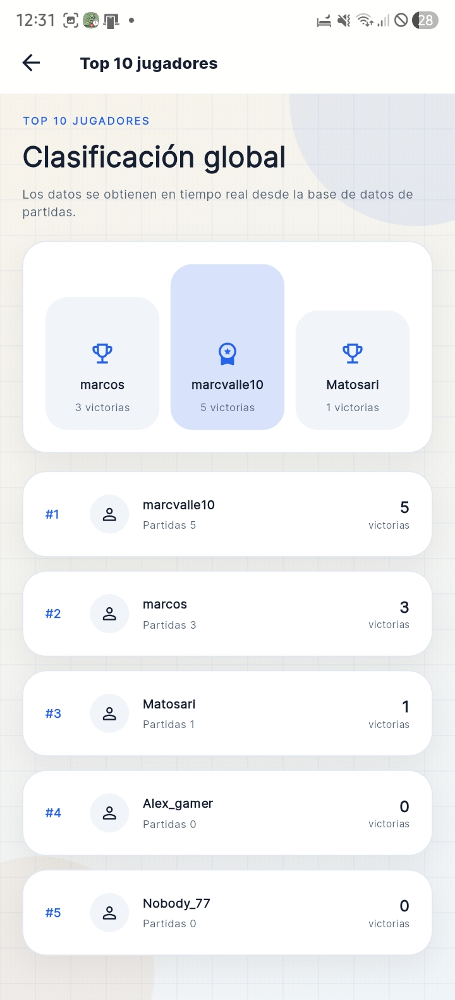
</tr>
</table>
</div>

---

## ▶️ Instrucciones para ejecutar

```bash
flutter clean
flutter pub get
flutter run
```

### Generar APK

```bash
flutter build apk --release
```

Archivo generado:

```
build/app/outputs/flutter-apk/app-release.apk
```

---

## 🧪 Estado actual

- ✅ Funcionalidad de juego en red con múltiples modos y tableros configurables
- ✅ Autenticación Firebase + UI de usuario
- ✅ Repositorios con lógica de partida, resultados e historial

---
